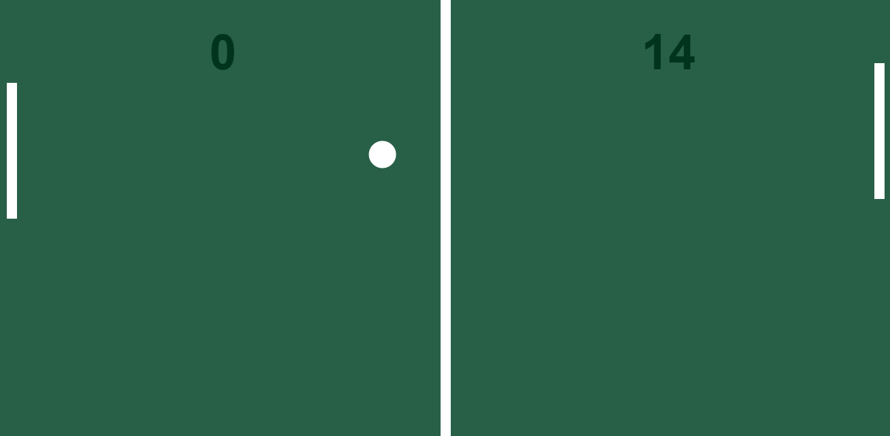

<h1 align="center"> Ping-Pong | Game </h1>

Programa promovido pelo curso DevSamurai_ para ensino de tecnologias WEB.  

  <a href="#-tecnologias">Tecnologias</a>&nbsp;&nbsp;&nbsp;|&nbsp;&nbsp;&nbsp;
  <a href="#-projeto">Projeto</a>

  

 

  

## 🚀 Tecnologias

Esse projeto foi desenvolvido com as seguintes tecnologias:

- HTML
- Canvas
- JavaScript
- Git e Github

## 💻 Projeto

O Ping-Pong | game é um programa para um oara testar e treinar lógica de programação, divirta-se!

- [Acesse o projeto finalizado, online](https://otaviofer.github.io/Ping-Pong-Game/)

## :memo: Licença

Esse projeto está sob a licença MIT.

---

Feito Por Otávio Fernandes, através da plataforma DevSamurai :wave: [Participe da nossa comunidade DevSamurai!](https://www.instagram.com/devsamurai)
